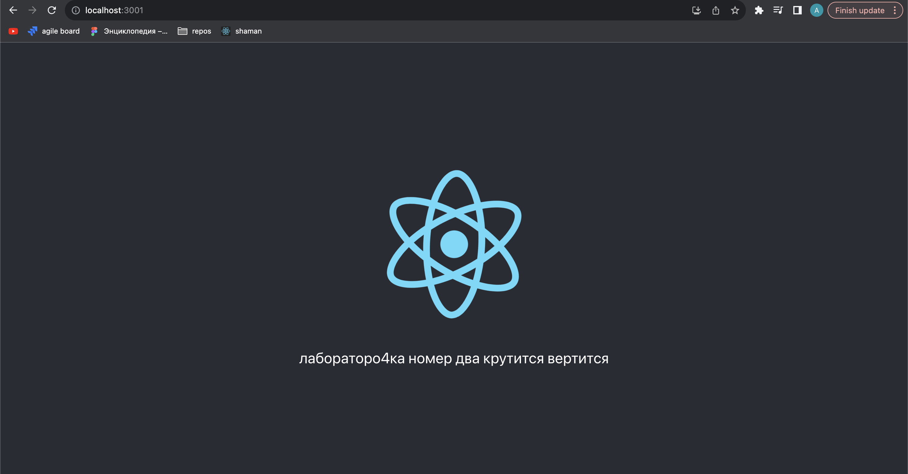

# Лабораторная работа 2

## Цель работы:

Написать два Dockerfile – плохой и хороший. Плохой должен запускаться и работать корректно, но в нём должно быть не менее 3 “bad practices”. В хорошем Dockerfile они должны быть исправлены. В Readme описать все плохие практики из кода Dockerfile и почему они плохие, как они были исправлены в хорошем  Dockerfile, а также две плохие практики по использованию этого контейнера

## Хороший Dockerfile

1. Создадим директорию и инициализируем там CRA:

   `npx create-react-app my-app --template typescript`

2. Создаем Dockerfile, где:

   2.1 Задаем базовый образ (используем node-alphine для уменьшения размера образа)

   ```
   FROM node:16.14.0-alpine
   ```

   2.2 Копируем содержимое в /app, исключая то, что указано в `.dockerignore`

   ```
      WORKDIR /app

      COPY . /app
      COPY package.json package-lock.json /app/

   ```

   2.3 Устанавливаем зависимости из package-lock (чтобы npm не решил поднять какой-нибудь пакета на новую мажорную версию и не сломать обратную совместимость ) и serve для мини-сервера

   ```
      RUN npm install --package-lock-only && npm ci
      RUN npm install -g serve

      RUN npm run build

      CMD serve -s build
   ```

   2.4. Билдим приложение и указываем команду, запускаемую внутри контейнера, для сервера

   ```
      RUN npm run build
      CMD serve -s build

   ```

3. Добавляем `.dockerignore`, куда добавляем избыточные файлы для сборки

4. Собираем наш контейнер:

   `docker build -t lab2 . `

5. Запускаем, связывая порт приложения (3000) и желаемый порт на нашей машине (3001):

   `docker run  -p 3001:3000 lab2 `

6. Работает:

   

## Плохой Dockerfile

### Bad practices

1. Неверное или избыточное использование родительского образа:

   `FROM node:latest`

   Нарушает неизменность контейнера, при появлении новой мажорной версии ноды случится обратная несовместимость. Также можно использовать node-alpine для снижения размера контейнера (1.5Гб -> ~500Мб)

   В хорошем использована конкретная версия ноды alpine

2. Неверное объединение директив:

   ```
      RUN npm install --package-lock-only \
            && npm ci \
            && npm install -g serve \
            && npm run build
   ```

   Best practices советует объединять только команды, которые в купе не будут изменяться, для того, чтобы в случае изменения одной из них, не приходилось пересобирать целый слой

   В хорошем более осмысленно разделены команды, учитывая, что npm run build может нуждать в более тонкой настройке

3. Избыточные файлы для сборки

   Неиспользование `.dockerignore` приводит к увеличению размера контейнера:

   

   В хорошем Dockerfile был добавлен `.dockerignore`

## Bad practice использования

Единственное, чего стоит остерегаться - при масштабировании системы и появлении нормального backend'a не стоит нагружать этот контейнер им.
